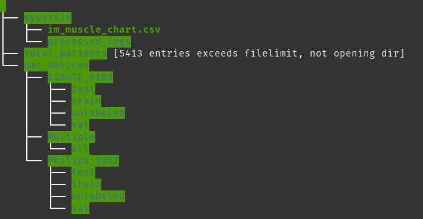

# Neuromuscular disease screening with deep learning

This repository contains the code for my [master's thesis](https://drive.google.com/file/d/1Rv9-Vmu7iP8TLgokFYH3TMJTc-Mc8PF3/view?usp=sharing) on device-invariant classification of sets of ultrasound images. 
A brief description of the project and its aims and results can be found [here](https://www.ai-for-health.nl/projects/muscle_us/). 

## Module description
The following table briefly describes the high-level module structure of this project.

| Folder        | Description |
|---------------|-------------|
| [baselines](baselines)    | Code for the rule-based and ML baselines, as well as for domain mapping.|
| [deployment](deployment)    | Various utilities for the prototype on the grand-challenge.org page.|
| [experiments](experiments)   | Scripts for the hyperparameter optimization conducted for each method.            |
| [final_models](final_models)      | Regression and trad ML models trained for baseline analysis.   |
| [imagenet](imagenet)      | A brief investigation into how ultrasound images look to pre-trained models.   |
| [inference](inference)      | Utilities related to performing inference with trained models.             |
| [loading](loading)       | Dataset and data loader classes for accessing MUS data.            |
| [models](models)        | Custom neural network classes.            |
| [notebooks](notebooks)     | Various ipynb notebooks for informal experimentation and data analysis.            |
| [preprocessing](preprocessing) | Scripts for data formatting and preprocessing.            |
| [scripts](scripts)       | Minor helper scripts.            |
| [utils](utils)         | Various utilities used throughout the project.            |
| .             | Entry points for training single models.            |

## UMC data preprocessing
Patient records are stored in a nested folder structure with no central database listing all available records. 
Each record consists of a number of ultrasound images in DICOM format, an XML file with patient level
information produced by Qumia (a tool for recording muscular ultrasound) and a separate folder that contains a number of MATLAB files with region-of-interest
(ROI) annotations and a MATLAB file with image-level information.

The [MATLAB preprocessing script](preprocessing/MATLAB/copyPatients_new.m) is used to filter and preprocess patient records.
It copies over records one by one, cropping images contained in them and saving them in png format.
Additionally, it generates a table of records (records.csv) and a table of images (images.csv). These tables are then used
in a [Python notebook](preprocessing/MUS_preprocessing.ipynb) and combined with labels available in separate files. 
The notebook contains some manual adjustments that can be tweaked, e.g. for muscle remaming and merging patient records taken on the same day.
The two-part structure was necessary as Python code could not be easily executed on the machines housing
the original data, but a future revision should focus on integrating both steps and allowing more
direct ingestion of patient labels in a single step.
The files generated during execution of the notebook are used as the data tables for all the experiments.
Specifically, for each dataset (e.g. each machine) there is one table with all patients, one with all records and one with all images. Together with the folder 
containing the images that was produced by the MATLAB script, these tables can be used to train models. 

**Products**:
* A: A folder containing processed datasets for different machines, with an associated split (devices).
* B: A folder containing patient records and processed images, generated by MATLAB (total_patients).

## JHU data preprocessing
Additional data was released by Johns Hopkins University [here](https://github.com/jalbayd1/myopathy_US).
We include [a notebook](notebooks/Myositis_preprocessing.ipynb) that automatically downloads the images and processes them to be used for this project.
However, a manual step is necessary, as the xlsx file provided by the authors is incorrect and there is no
way to directly import the mat file. Use MATLAB to save the table in the mat file in csv format and then use it as an input for the notebook.

**Products**
* C: A csv file containing patient information and the association with the images.
* D: A flat folder containing processed muscle images produced by the notebook.

## Data access
To make the data accessible for baselines and network training, it needs to be correctly placed.

For describing a dataset, we use the [SetSpec](loading/loaders.py) data class. It contains a device name,
a dataset type (currently 'jhu' for the myositis dataset from JHU and 'umc' for RadboudUMC data),
a list of split names (e.g. train, val, test), the path that contains the patient labels and the img_root_path, i.e.
the folder that contains the patient image folders.

Throughout the project, we use dictionaries that map from dataset-split names to the respective SetSpec. 
To avoid having to always respecify the exact paths, there is a global configuration for the paths to be set [here](utils/experiment_utils.py).

Choose a folder that will contain all the data and place it in the *local_data_path* variable. Then, place the four products
from the two previous steps in that folder and make sure to include the subfolder names in the configuration file.



*Sample folder structure.*

```
# the folder that contains the patient data pickle files, separate for each device (A)
umc_data_subpath = 'umc_devices/'
# the folder that contains the patient records with images in them (B)
umc_img_subpath = 'total_patients/'
# the folder that contains the patient file from the JHU dataset (C)
jhu_data_subpath = 'myositis/'
# the folder that contains processed images from the JHU dataset (D)
jhu_img_subpath = 'myositis/processed_imgs'
```
*The associated settings in the config file.*

## Running baselines
The [baselines script](run_baselines.py) contains the code for running the rule-based baseline and the traditional machine learning condition.
The user can specify which machines to use as source and target and which subset to use for the evaluation (validation and test set). 
The script creates a nested folder structure for saving the results and then saves the predictions by each method as a csv file. 
The output generated by this script as used for the final analysis of the thesis can be found [here](roc_analysis).
It also contains code for the adjustment baselines (e.g. brightness-based and regression) and will perform all possible combinations
of the methods with the different adjustments.

## Training neural networks
All neural network training runs will be automatically logged to an online dashboard powered by [Neptune](https://neptune.ai/).
This allows to inspect metrics and compare different hyperparameters. For this to work and training to proceed, you need to create an
account for the service and place your API token in [this file](utils/tokens.py). Additionally, make sure to create a project in 
your neptune account and specify this in the code by means of the project_name config parameter where applicable.

For training a single network in the image aggregation condition, use [this script](train_image_level.py). Hyperparameters currently 
can be adjusted in the code only.

For training a single network in the multi-instance learning condition, use [this script](train_multi_input.py).

For replicating experiments presented in the thesis, use the respective script from [this folder](experiments).

## Evaluation
Once an experiment involving multiple runs has been completed, we can evaluate which particular hyperparamters performed best.
An easy and direct way is to access the web UI of the Neptune logging dashboard. Logged metrics can then be inspected and runs
can be sorted by performance. More powerful comparisons of the performance are possible by retrieving experiment data via
the Neptune API. A sample script for this purpose can be found [here](notebooks/Experiments_analysis.ipynb).

To compare the best condition for each run for the final comparison, it first needs to be picked. For example, we found that
the 7th epoch of the 'MIL-28' experiment performed best of all the MIL runs trained on Esaote. This model can be evaluated
directly on the test set, alternatively, we can also retrain with the same settings, this time also including the validation
set, by means of the [retraining script](retrain_from_checkpoint.py).

To evaluate multiple models one after another, add them to the [list of conditions](inference/conditions.py) and then run the
[model testing script](inference/test_models.py). Results will be written into the same ROC analysis format as used for the baselines,
allowing all the results to be compared to one another. The ROC analysis itself was implemented in R 
(see [this script](scripts/compare_roc.r)) and directly accesses the folder that contains the results.

## Inspecting training data
There is some basic functionality for inspecting training images. The [visualization script](scripts/visualize_mus_images.py)
can both export single images with various domain-mapping strategies applied (e.g. with brightness adjustment) as well as
exporting a combined visualization of one image per muscle.

## Data to hand over

labeledPatients_cramp_controls.xlsx: The output of the label merger script. Contains ids and associated diagnosis for the originally labelled patients.
Needs to be used as the input to the MATLAB copying script.
